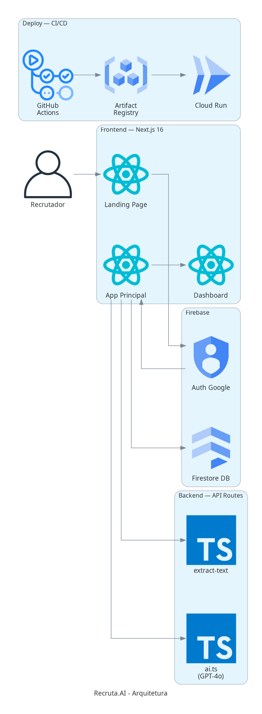

# 📖 Documentação Geral — Recruta.AI

## Visão Geral

O **Recruta.AI** é uma plataforma de recrutamento inteligente que utiliza GPT-4o para automatizar a triagem de candidatos, gerar perguntas técnicas personalizadas e fornecer avaliações baseadas em dados para tomada de decisão.

---

## Funcionalidades

### 🏠 Landing Page
- Apresentação da plataforma com seções: Hero, Features, Como Funciona e CTA
- Login via Google OAuth integrado ao Firebase Authentication
- Design responsivo com suporte a dark mode

### 🔐 Sistema de Autenticação e Aprovação
- Login com Google (Firebase Auth)
- Ao logar pela primeira vez, o usuário é registrado no Firestore com `approved: false`
- Tela de "Acesso Pendente" até um administrador aprovar manualmente
- Aprovação feita diretamente no Firebase Console (`users/{uid}.approved = true`)

### 📋 Gestão de Processos Seletivos
- Criação de processos organizados por **nome da vaga** (ex: "Analista de BDR", "Dev Fullstack")
- Tela "Meus Processos" com cards mostrando: nome da vaga, total de candidatos, avaliados e top score
- Retomada de processos anteriores — dados persistem no Firestore
- Exclusão de processos

### 📄 Upload de Currículos
- Upload múltiplo de PDFs e DOCX de uma só vez
- Extração de texto com dois parsers (fallback automático):
  - **pdf-parse** — parser primário, rápido
  - **pdfjs-dist** — fallback para PDFs corrompidos (mesmo engine do Chrome)
- Suporte a arquivos .txt e colagem de texto manual
- Feedback em tempo real: "Extraindo currículo 3 de 10: Maria_Silva.pdf"
- PDFs escaneados (imagem) retornam erro amigável sem travar o processo

### 🤖 Análise por IA (GPT-4o)
- **Compatibilidade CV x Vaga** — Score de 0 a 100 com justificativa detalhada
- **Geração de Perguntas** — 3 perguntas técnicas/comportamentais específicas cruzando CV com requisitos da vaga
- **Avaliação Final** — Probabilidade de contratação (0-100) com feedback técnico e comportamental
- Todas as chamadas usam `response_format: json_object` para respostas estruturadas

### 📝 Entrevista Guiada
- Questionário técnico com 3 perguntas personalizadas por candidato
- Campo de anotações por pergunta para o recrutador registrar observações
- **Anotações livres do recrutador** — impressões gerais, red flags, pontos de destaque
- As anotações livres são enviadas para o GPT-4o como contexto adicional na avaliação final
- Modal com opção de **tela cheia** para melhor experiência durante a entrevista

### 📊 Dashboard e Métricas
- Painel com 4 métricas: Total de Candidatos, Analisados, FIT >60%, Avaliados
- Gráfico horizontal do **Top 5** candidatos por probabilidade de contratação
- Cores dinâmicas: verde (>75%), amarelo (50-75%), vermelho (<50%)

### 🗂️ Cards de Candidatos
- Status visual por candidato: Pendente → Analisando → Analisado → Em Entrevista → Avaliado
- Scores de aderência e contratação visíveis no card
- Clique para abrir o fluxo completo do candidato

### 🌙 Dark Mode
- Suporte completo a tema claro/escuro via next-themes
- Toggle no navbar
- Respeita preferência do sistema

---

## Stack Tecnológica

| Camada | Tecnologia | Versão |
|--------|-----------|--------|
| Framework | Next.js (App Router) | 16.1.6 |
| UI | React | 19.2.3 |
| Linguagem | TypeScript | 5.x |
| Estilização | Tailwind CSS | 4.x |
| IA | OpenAI API (GPT-4o) | — |
| Autenticação | Firebase Auth (Google) | 12.x |
| Banco de Dados | Cloud Firestore | — |
| Gráficos | Recharts | 3.8.x |
| Ícones | Lucide React | 0.577.x |
| PDF Parser 1 | pdf-parse | 1.1.1 |
| PDF Parser 2 | pdfjs-dist | 4.9.x |
| DOCX Parser | mammoth | 1.11.x |
| Validação | Zod | 3.25.x |

---

## Arquitetura



### Fluxo de Dados

```
Recrutador → Landing Page → Google Auth → App Principal
                                              ↓
                                    Upload Vaga + CVs
                                              ↓
                                    API extract-text (PDF/DOCX → texto)
                                              ↓
                                    GPT-4o (compatibilidade + perguntas)
                                              ↓
                                    Board de Candidatos + Dashboard
                                              ↓
                                    Entrevista (anotações do recrutador)
                                              ↓
                                    GPT-4o (avaliação final)
                                              ↓
                                    Resultado + Firestore (persistência)
```

### Estrutura de Arquivos

```
src/
├── app/
│   ├── api/extract-text/route.ts   → Extração de texto (PDF/DOCX)
│   ├── app/page.tsx                → Área principal (entrevista)
│   ├── app/history/page.tsx        → Histórico de entrevistas
│   ├── login/page.tsx              → Login (legado)
│   ├── page.tsx                    → Landing page
│   ├── layout.tsx                  → Layout global + footer
│   └── globals.css                 → Estilos globais
├── components/
│   ├── RecruiterInterview.tsx      → Fluxo principal (HOME/SETUP/BOARD)
│   ├── CandidateCard.tsx           → Card individual do candidato
│   ├── CandidateDetail.tsx         → Modal de entrevista (fullscreen)
│   ├── Dashboard.tsx               → Métricas e Top 5
│   ├── Navbar.tsx                  → Navegação + theme toggle
│   ├── ProtectedRoute.tsx          → Guard de auth + aprovação
│   ├── ThemeProvider.tsx           → Provider de tema
│   └── ThemeToggle.tsx             → Botão dark/light mode
├── contexts/
│   └── AuthContext.tsx             → Firebase Auth + check aprovação
└── lib/
    ├── ai.ts                       → 3 funções OpenAI (server actions)
    ├── types.ts                    → Tipos (Candidate, CandidateStatus)
    └── firebase/
        ├── client.ts               → Configuração Firebase
        └── firestore.ts            → CRUD (processes, interviews, users)
```

---

## Infraestrutura

| Serviço | Projeto GCP | Região | Finalidade |
|---------|-------------|--------|------------|
| Cloud Run | homol-489313 | us-west1 | Hosting da aplicação |
| Artifact Registry | homol-489313 | southamerica-east1 | Imagens Docker |
| Cloud Build | homol-489313 | global | Build das imagens |
| Firebase Auth | ai-interviewer-ag2025 | — | Autenticação Google |
| Firestore | ai-interviewer-ag2025 | southamerica-east1 | Banco de dados |

### Coleções Firestore

| Coleção | Campos Principais | Índices |
|---------|-------------------|---------|
| `users` | uid, email, name, photoURL, approved, createdAt | — |
| `processes` | userId, roleName, jdText, candidates[], createdAt, updatedAt | userId + updatedAt |
| `interviews` | userId, candidateName, roleTitle, analysis, questions, createdAt | userId + createdAt |

---

## CI/CD Pipeline

```
git push main → GitHub Actions → Docker Build → Artifact Registry → Cloud Run
```

- **Trigger**: Push na branch `main`
- **Build**: Docker multi-stage (node:20-alpine)
- **Variáveis**: Firebase config como build args, OpenAI key como env var
- **Deploy**: Cloud Run com auto-scaling (0-2 instâncias)

---

## Segurança

- API Key da OpenAI apenas no servidor (variável de ambiente no Cloud Run)
- Credenciais Firebase como `NEXT_PUBLIC_` (seguro — são chaves públicas de client)
- Firestore Rules restritivas: cada usuário só acessa seus próprios dados
- Sistema de aprovação manual para novos usuários
- Header `Cross-Origin-Opener-Policy: same-origin-allow-popups` para Google Auth
- `.gitignore` exclui `.env`, `.env.local`, PDFs e arquivos de teste

---

## Custos Estimados (Uso Moderado)

| Serviço | Tier Gratuito | Custo Estimado |
|---------|---------------|----------------|
| Firebase Auth | 10k users/mês | Grátis |
| Firestore | 50k leituras/dia | Grátis |
| Cloud Run | 2M requests/mês | Grátis |
| Artifact Registry | 500MB | Grátis |
| OpenAI GPT-4o | — | ~$0.01-0.03 por análise |

---

*Documentação do projeto Recruta.AI — Última atualização: Março 2026*
